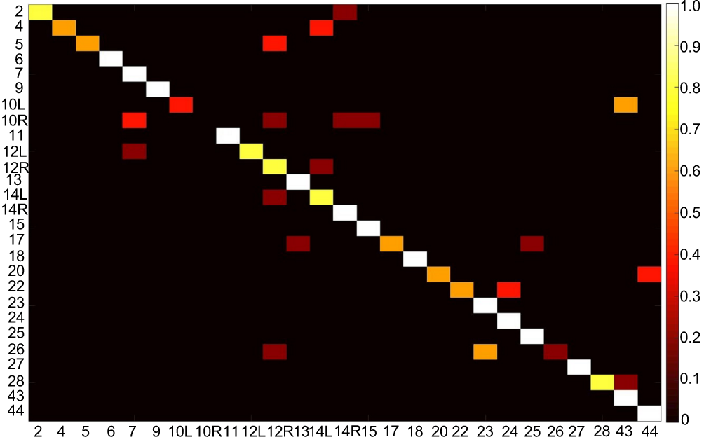

# FacialAU
This is temporary repository for trying my ICASSP'15 paper's program on facial action units.

Data can be downloaded at https://jh.box.com/s/y2txhhislvxv4zxr5cl6mdl2o64owd1q or from this GitHub repository (it is splitted into 4 parts due to the file size restricrion of GitHub).

Final performance over 20 runs:
Confusion matrix of CHi-SLR on facial AUs

Confusion matrix of SLR on facial AUs
#

Contact: xxiang@cs.jhu.edu
